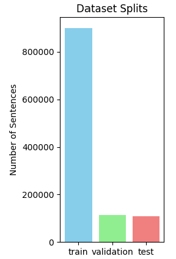
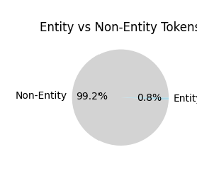
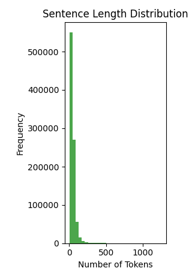
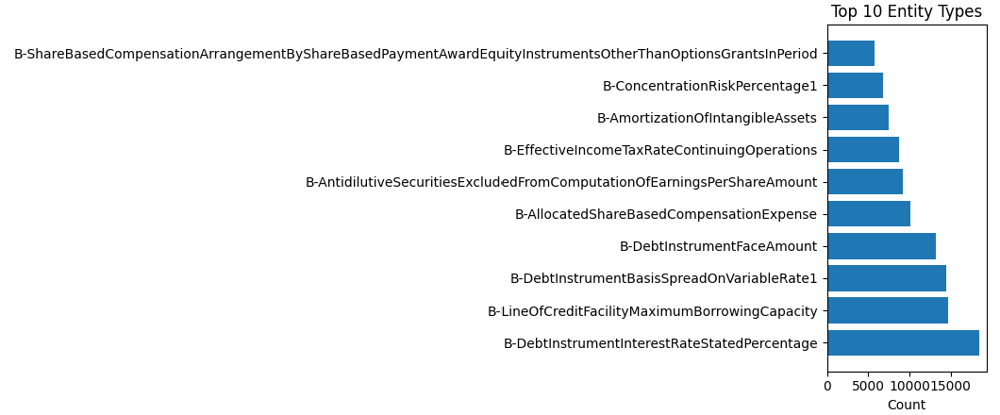

# Financial NER with FiNER-139 Dataset

A Financial Named Entity Recognition (NER) project using the FiNER-139 dataset, which contains financial texts annotated with 139 different financial entity types.

## Dataset Overview

**FiNER-139** is a specialized financial NER dataset containing:
- Financial documents from US company reports
- 139 different financial entity types (revenue, assets, liabilities, etc.)
- XBRL-based annotations for numerical entities
- Focus on context-dependent financial terms

### Dataset Statistics

<!-- Add your dataset statistics here -->
```
Dataset Splits:
    train       : 900,384 sentences, 40,827,499 tokens
    validation  : 112,494 sentences, 5,194,320 tokens
    test        : 108,378 sentences, 5,120,260 tokens
    Total       : 1,121,256 sentences, 51,142,079 tokens

Entity Analysis:
    Non-entity tokens (O): 0
    Entity tokens: 387,009
    Unique entity types: 169

Top 10 entity types:
  B-DebtInstrumentInterestRateStatedPercentage: 18,448
  B-LineOfCreditFacilityMaximumBorrowingCapacity: 14,730
  B-DebtInstrumentBasisSpreadOnVariableRate1: 14,469
  B-DebtInstrumentFaceAmount: 13,158
  B-AllocatedShareBasedCompensationExpense: 10,160
  B-AntidilutiveSecuritiesExcludedFromComputationOfEarningsPerShareAmount: 9,162
  B-EffectiveIncomeTaxRateContinuingOperations: 8,684
  B-AmortizationOfIntangibleAssets: 7,458
  B-ConcentrationRiskPercentage1: 6,779
  B-ShareBasedCompensationArrangementByShareBasedPaymentAwardEquityInstrumentsOtherThanOptionsGrantsInPeriod: 5,763   
```

## 🔍 Data Exploration

### Dataset Distribution
<!-- Add your dataset distribution plot here -->


### Entity Analysis
<!-- Add your entity analysis plots here -->


### Sentence Length Distribution
<!-- Add your sentence length plot here -->


### Top Entity Types
<!-- Add your top entity types plot here -->



## 🚀 Quick Start

### 1. Data Preprocessing

```python
from data_exploration_and_preprocessing import FiNERProcessor

# Load and explore the dataset
processor = FiNERProcessor()
processor.run_complete_analysis()

# Or use the quick function
processor = load_and_explore()
```

### 2. Load Processed Data

```python
import json

# Load the processed dataset
with open('finer139_processed.json', 'r') as f:
    data = json.load(f)

print(f"Training sentences: {len(data['train'])}")
print(f"Labels available: {list(data['label_mapping'].keys())}")
```

## Project Structure

```
financial-ner/
├── README.md
├── data_exploration_and_preprocessing.py       # Data preprocessing script
├── finer139_processed.json                     # Processed dataset
├── plots/                                      # Data exploration plots
└── models/                                     # Model training scripts (coming soon)
```

## Requirements

```bash
pip install datasets pandas matplotlib json
```

## Entity Types Examples

The FiNER-139 dataset includes financial entities such as:

- **Financial Metrics**: Revenue, Assets, Liabilities, EBITDA
- **Numerical Values**: Share counts, Market capitalization
- **Financial Ratios**: P/E ratio, Debt-to-equity ratio
- **Time Periods**: Quarterly reports, Fiscal years
- **Financial Instruments**: Stocks, Bonds, Derivatives

### Sample Annotations

```
Text   : The company reported revenue of $2.5 billion for Q3 2023
Labels : O O O revenue O O O O O O

Text   : Apple Inc's market cap reached $3 trillion dollars
Labels : ORG O O O O O O O
```

## Key Features

- **Financial Focus**: Specialized for financial document processing
- **Rich Annotations**: 139 different financial entity types
- **Large Scale**: Over 1M annotated sentences
- **Real-world Data**: From actual US company reports
- **Context-aware**: Handles context-dependent financial terms

## Model Development (Coming Soon)

- [ ] Baseline BERT model for financial NER
- [ ] Fine-tuned FinBERT implementation  
- [ ] Performance benchmarks and evaluation
- [ ] Error analysis and improvements

## Dataset Source

- **Hugging Face**: [nlpaueb/finer-139](https://huggingface.co/datasets/nlpaueb/finer-139)
- **Zenodo**: [https://zenodo.org/record/6339605](https://zenodo.org/record/6339605)
- **Paper**: [FiNER-139: A Nested Named Entity Recognition Dataset for Financial Documents](https://arxiv.org/abs/2302.11157)

## Usage Notes

1. **Data Format**: The dataset uses standard BIO tagging scheme
2. **Entity Types**: Focus on numerical financial entities with contextual meaning
3. **Preprocessing**: Run the preprocessing script to explore and understand the data
4. **Model Training**: Use the processed JSON file for training your NER models
